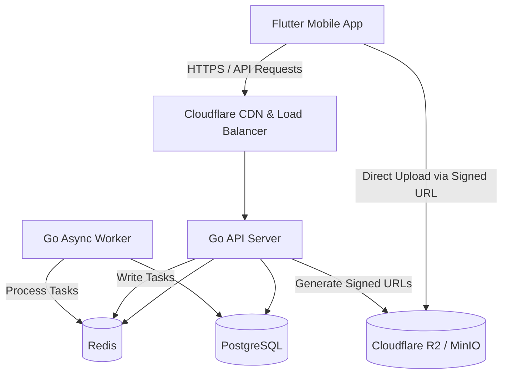

# System Architecture - TN NOW

This document details the architectural layout, design principles, and package structures for the **TN NOW** discovery platform.

---

## 1. High-Level System Overview



---

## 2. Flutter Mobile Architecture

We adhere to a **Feature-first Clean Architecture** pattern. This separates the codebase by feature rather than layer at the root, making features modular and self-contained.

### Core Folder Structure

```text
mobile/
└── lib/
    ├── core/                   # Shared system-wide utilities
    │   ├── config/             # App environments, global flags
    │   ├── constants/          # UI sizes, colors, asset paths
    │   ├── errors/             # App Exceptions and Failure mappings
    │   ├── extensions/         # Custom Dart Extensions
    │   ├── localization/       # Internationalization (English/Tamil)
    │   ├── network/            # Dio client config, interceptors
    │   ├── routing/            # GoRouter navigation configuration
    │   ├── storage/            # Flutter Secure Storage helper
    │   ├── theme/              # Material 3 style parameters
    │   ├── utils/              # Base helpers
    │   └── widgets/            # Globally reused UI components (TNButtons, TNAppBar)
    │
    ├── features/               # Module directories grouped by feature
    │   ├── auth/               # Login, registration, guest session
    │   ├── home/               # Base feed dashboard
    │   ├── content/            # Stories, photo view, detail screens
    │   ├── video_link/         # YouTube/Instagram oEmbed rendering
    │   ├── events/             # Native events list and submission
    │   ├── contributor/        # Profile statistics, trust badges, leaderboard
    │   └── nearby/             # Location radius-based discovery
    │
    └── main.dart               # App initialization entry point
```

### Clean Architecture Layers (Per Feature)

Within each folder inside `features/`, code is divided into three distinct layers:
1. **Presentation Layer**: Widgets, Riverpod StateNotifier Providers, Controllers, and State objects.
2. **Domain Layer**: Framework-independent business rules, Entity definitions, and Repository Interfaces.
3. **Data Layer**: Data Sources (remote/local api calling), Data Transfer Objects (DTOs via Freezed & json_serializable), and concrete Repository Implementations.

---

## 3. Go Backend Architecture

The backend uses a standard Go layout matching the **Handler-Service-Repository** pattern. This enforces strict separation of concerns, simplifies testing with mocks, and avoids heavy ORMs in favor of raw SQL efficiency via `sqlc`.

```text
HTTP Request ---> Handler (chi) ---> Service (Domain Logic) ---> Repository (Database pgx) ---> PostgreSQL
```

### Folder Structure

```text
server/
├── cmd/
│   ├── api/                    # API Server Entry point (main.go)
│   ├── worker/                 # Async Queue Worker entry point
│   └── migrate/                # Schema Migrations runner
│
├── internal/                   # Private domain packages
│   ├── auth/                   # Users, Sessions, and JWTs
│   ├── content/                # Photos, stories, events, and common core content table
│   ├── videolinks/             # oEmbed, canonical verification and domain allow-list
│   ├── contributors/           # Level calculation, points, trust scores, and badges
│   ├── moderation/             # Automated risk analysis, text filtering, queue rules
│   ├── compliance/             # Grievance registration, audit log, takedown SLA tracking
│   └── search/                 # Location/Language agnostic full-text search
│
├── pkg/                        # Shared reusable utility packages
│   ├── logger/                 # zerolog/slog structured logger
│   ├── storage/                # Object storage provider (R2/MinIO client)
│   ├── auth/                   # JWT & Hashing utils (bcrypt/Argon2id)
│   └── pagination/             # Cursor pagination helpers
│
└── migrations/                 # DB migrations (SQL)
```

---

## 4. Architectural Rules and Guidelines

1. **State Management**: Do not place business logic or data fetching inside Flutter Widgets. Use Riverpod providers.
2. **State Immutability**: All domain models and UI states in Dart must be immutable. Use `@freezed` models.
3. **Server Security**: The client must never be trusted. Perform role-based access control (RBAC), size limits, and sanitization exclusively on the Go server.
4. **Asynchronous Execution**: Perform costly operations (e.g., automated image validation, notifications) inside the background Queue Workers instead of blocking the main thread of HTTP Handlers.
