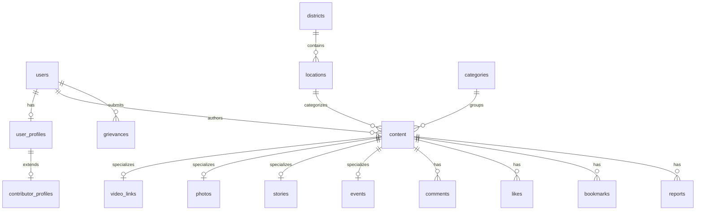

# Database Design & Schema Specification - TN NOW

TN NOW uses PostgreSQL for relational data storage and Redis for high-velocity caching and rate limiting.

---

## 1. Schema Entities Relation Chart

---

## 2. Table Schemas Specification

### Users & Profiles
- **`users`**: Auth credentials, hashed passwords, roles.
- **`user_profiles`**: User metadata (avatars, names).
- **`contributor_profiles`**: Contributor progress trackers (points, badges, trust scores, founding flag).

### Geographic & Categories
- **`districts`**: Pre-seeded regions database (Madurai, Chennai, etc.).
- **`locations`**: Geo-location definitions (lat/lng bounds, district relations).
- **`categories`**: Dynamic taxonomy definition mapping.

### Core Content Table
- **`content`**: Master table tracking title, description, content type (`VIDEO_LINK`, `PHOTO`, `TEXT_STORY`, `EVENT`), status, publisher user, geographic filters, and counts.
- **`video_links`**: Tracks external platforms (YouTube, Instagram, Facebook), external video IDs, embed HTML, and status check timestamps.
- **`photos`**: Native photo posts uploads metadata mapping.
- **`stories`**: Headline and short body text stories.
- **`events`**: Event timing, dates, and locations.

### Interactions & Moderation
- **`comments`**, **`likes`**, **`bookmarks`**, **`follows`**: Social interaction tracking.
- **`reports`**: Violation tracking, reason category, reviewer notes, and status.
- **`moderation_results`**: Auto-moderation scoring results (toxicity, nudity ratings).
- **`grievances`**: Indian IT Rules 2021 complaint intake log (SLA timestamped).

---

## 3. Database Indexing Strategy

To maintain performance targets (p95 < 500ms):
- **B-tree Indexes** on foreign keys and filter fields (`status`, `published_at`, `category_id`, `district_id`).
- **Composite Indexes** for cursor searches (e.g., `(published_at DESC, id DESC)`).
- **Unique Indexes** on `external_video_id` to prevent duplicate video submissions.
