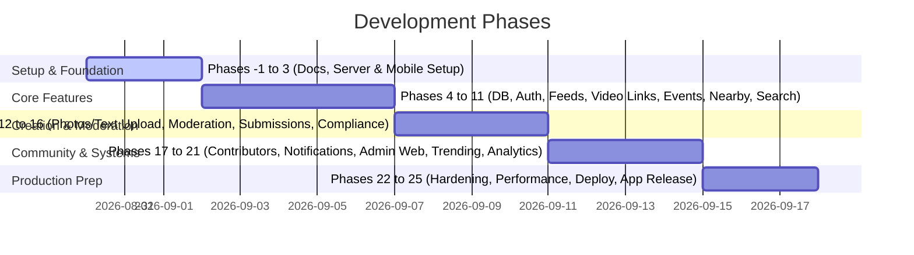

# Development Roadmap - TN NOW

TN NOW is developed in modular phases, ensuring each phase passes validation checks and builds successfully before proceeding.

---

## Roadmap Phases Summary

---

## Detailed Phases Description

- **Phase -1: Creator Seeding**: Build creator relations to onboard seed videos and stories so the feed is not empty at launch.
- **Phase 0: Product Specification**: Setup design architecture, APIs, database, and security documents (Current).
- **Phase 1: Repository Foundation**: Init Go project, Flutter layout, Docker compose with Postgres, Redis, MinIO, and Makefile commands (Current).
- **Phase 2: Flutter Foundation**: Establish themes, routing (GoRouter), localization, secure storage, and Riverpod structure.
- **Phase 3: Go Foundation**: Setup Chi router, CORS, logger, error recovery, and OpenAPI endpoints.
- **Phase 4: Database & Migrations**: Write schema files, trigger auto-migration setup, and generate code with `sqlc`.
- **Phase 5: Authentication & Sessions**: Implement secure register, login, refresh, logout, and guest sessions.
- **Phase 6: Home Feed Module**: Integrate unified landing page API and widget feeds.
- **Phase 7: Content Interactions**: Develop comments, likes, saves, shares, and follow APIs.
- **Phase 8: Video Links Module**: Code oEmbed URL resolver withallowlist restrictions and in-app embedded players.
- **Phase 9: Events Module**: Native events creation, lists, and filter widgets.
- **Phase 10: Nearby Discovery**: Geographic radius filters (5km / 10km / 25km) and manual district settings.
- **Phase 11: Search Module**: Tamil/English/Tanglish fuzzy matching full-text queries.
- **Phase 12: Photo & Text Creator Loop**: Upload media directly to MinIO/R2 via pre-signed URLs and register posts.
- **Phase 13: RESERVED**: Native video upload (Future Phase).
- **Phase 14: Moderation Engine**: Unified text slang normalization and image safety scanning.
- **Phase 15: Submissions Panel**: Unified creation selector dashboard.
- **Phase 16: Compliance & Legal**: Indian IT Rules 2021 grievance forms, audit logging, and takedown SLA jobs.
- **Phase 17: Contributor Mechanics**: Contributor levels, reputation points, badges, leaderboard, and founding badges.
- **Phase 18: Push Notifications**: FCM configuration, topic subscriptions, and device token storage.
- **Phase 19: Admin Dashboard**: Web management view for posts, moderation review queue, and compliance logs.
- **Phase 20: Trending Calculations**: Decay scores based on velocity, recency, location, and report penalties.
- **Phase 21: Analytics Pipeline**: Capture content impression and click analytics without invading user privacy.
- **Phase 22: Security Hardening**: Static analysis, SSRF domain tests, and authorization audits.
- **Phase 23: Performance Tuning**: DB index checking, Redis caching checks, and load target metrics validation.
- **Phase 24: Deployment Setup**: CI/CD deployment pipelines to Docker staging environments.
- **Phase 25: App Release & Guidelines**: Store listing preparation, privacy policy disclosures, and live monitoring.
