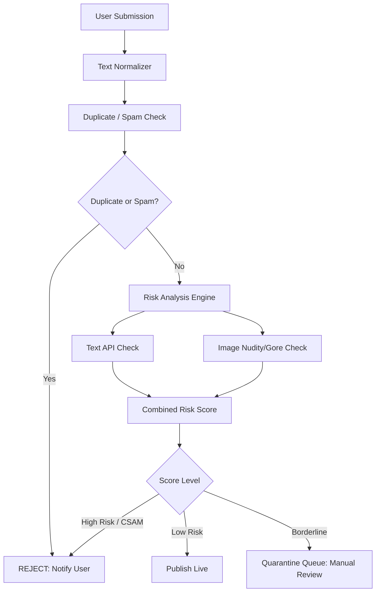

# Automated Content Moderation Specification - TN NOW

TN NOW ensures high content quality and safety by passing all text descriptions and media elements through an automated moderation pipeline.

---

## 1. Automated Moderation Workflow

---

## 2. Text Normalization & Slang Filters

1. **Normalization**: Unicode representation cleanup for Tamil script. Homoglyph translation to prevent obfuscation.
2. **Tamil/Tanglish Slang Dictionary**: Regular expressions for vulgarities, slurs, and toxic terms in Tamil, English, and Tanglish.

---

## 3. Image Safety Analysis (Thumbnails & Native Uploads)

- Automated safety verification (e.g., via AWS Rekognition, Google Cloud Vision, or self-hosted models) evaluates images for:
  - **Explicit Content / Nudity**: Auto-reject score > 80%.
  - **Graphic Violence / Gore**: Auto-reject score > 80%.
  - **Minors / CSAM**: Zero-tolerance. Immediate rejection, account suspension, and logging.

---

## 4. Duplicate Detection Heuristics

1. **Video Links**: Strict canonical matching of `external_video_id` prevents submitting identical links.
2. **Photos**: Fast perceptual hashing (pHash) on the server blocks duplicate photo posts within a 24-hour window.

---

## 5. Human Moderator Quarantine Queue SLA

When content falls into `QUARANTINE` status:
- It is hidden from the public feed.
- It is pushed to the Admin Moderation Dashboard.
- **SLA**: A human moderator must review and action (`Approve` or `Reject`) the item within **24 hours**.
- Audit log records the moderator user ID and review time.
